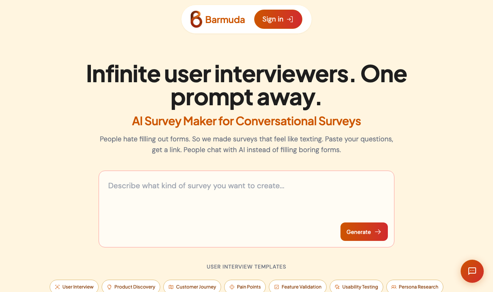

  

<h1 align="center">Barmuda</h1>

<b>People hate filling out forms. So we made surveys that feel like texting.</b>

  <a href="https://barmuda.in"><b>Live at barmuda.in</b></a>

Paste in your questions, get a link. Instead of staring down a 20-question form, your respondents chat with an AI one question at a time, like texting a friend. You still get clean, structured data back (CSV, exactly as you would expect), just with a lot more people actually finishing.

## Why it exists

Static forms quietly leak responses. People see a long list of questions, feel the work coming, and give up. You are lucky to hit a 10% completion rate, and the ones who do finish are usually rushing to the end.

Barmuda flips the format. Same questions, delivered as a friendly back-and-forth. It does not feel like homework, so more people reach the last question and the answers are more considered. Think of it as infinite user interviewers, one prompt away.

## How it works

1. **Paste your questions.** Pull them from Google Forms, a doc, anywhere, or just type them out. The AI reads your text and infers a proper structured survey, question types and all.
2. **Share the link.** Send it however you like. It works on any device.
3. **People chat, you collect.** The AI asks one question at a time, adapts to each reply, and quietly assembles the structured answers in the background.
4. **Export like normal.** Download everything as CSV, and read responses in a dashboard with charts and word clouds.

## What you get

- **Paste text, get a survey** (the AI figures out the questions for you)
- **Chat interface** that feels like texting, not filling a form
- **Ready-made templates** for user interviews, product discovery, churn, pricing, and more
- **CSV export** in the standard format you already work with
- **Dashboard** with charts and word clouds to read responses at a glance
- **Voice mode** for spoken answers

## Under the hood

Flask backend, Firebase for Google login and Firestore storage, and an LLM layer that both infers the survey from your text and runs the live conversations. Deployed on Vercel. This is a real product with usage-based pricing, not a toy: every conversation costs API money, so paid plans keep the lights on.

## Status

Live and in active use at [barmuda.in](https://barmuda.in). New but real. Feedback welcome.
